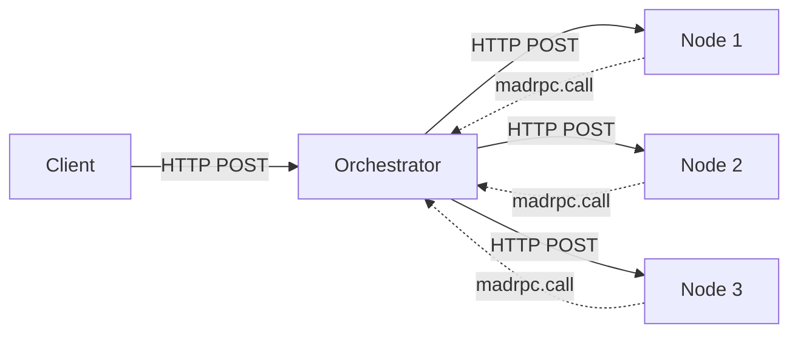

# MaDRPC - Massively Distributed RPC

MaDRPC is an experimental distributed RPC system that enables massively parallel computation by executing JavaScript functions across multiple nodes. It's a hobby project built to explore distributed systems, JavaScript engine integration, and concurrent programming patterns.

## Overview

MaDRPC allows you to write JavaScript functions that can be called remotely via RPC, with support for async/await and parallel execution across multiple compute nodes. The system uses:

- **Boa** - A pure Rust JavaScript engine for executing user code
- **HTTP/JSON-RPC 2.0** - Standard HTTP protocol with JSON-RPC 2.0 for transport
- **Tokio** - Async runtime for all components
- **Hyper/Axum** - HTTP server and client libraries

### What Makes It Interesting

**JavaScript-Driven Parallelism**: Unlike traditional RPC systems where the client orchestrates parallel work, MaDRPC lets JavaScript functions make async RPC calls to other nodes. This means you can write distributed algorithms entirely in JavaScript using `async/await` and `Promise.all()`.

**Simple Orchestrator**: The orchestrator is a round-robin load balancer that forwards requests. It doesn't execute JavaScript or maintain complex state - it's a thin, efficient proxy.

**Async Request Handling**: Each component uses tokio async runtime with HTTP/1.1 keep-alive for efficient connection management. Nodes create a fresh Boa Context per request for true parallelism.

**Built-in Metrics**: All components expose metrics via `_metrics` and `_info` endpoints, with a terminal UI (`top` command) for real-time monitoring.

## Architecture



## Quick Start

### Installation

```bash
# Clone the repository
git clone https://github.com/podikoglou/madrpc-2.git
cd madrpc-2

# Build the project
cargo build --release
```

### Running the System

The CLI provides four subcommands:

```bash
madrpc <command>

Commands:
  node          Start a MaDRPC node (JavaScript execution server)
  orchestrator  Start a MaDRPC orchestrator (load balancer)
  top           Monitor a server with real-time metrics TUI
  call          Call an RPC method on a server
```

You'll need three components:

**1. Start the orchestrator** (load balancer):

```bash
cargo run -r -- orchestrator \
  -b 0.0.0.0:8080 \
  -n http://127.0.0.1:9001 \
  -n http://127.0.0.1:9002
```

**2. Start compute nodes** (in separate terminals):

```bash
# Terminal 2
cargo run -r -- node \
  -s examples/monte-carlo-pi.js \
  -b 127.0.0.1:9001 \
  --orchestrator http://127.0.0.1:8080

# Terminal 3
cargo run -r -- node \
  -s examples/monte-carlo-pi.js \
  -b 127.0.0.1:9002 \
  --orchestrator http://127.0.0.1:8080
```

**3. Make RPC calls** via the CLI:

```bash
cargo run -r -- call http://127.0.0.1:8080 aggregate
```

**4. Monitor with the TUI** (optional):

```bash
cargo run -r -- top http://127.0.0.1:8080
```

## Running with Docker

MaDRPC can be run using Docker or Docker Compose for easy deployment and testing.

### Building the Docker Image

```bash
# Build the image
docker build -t madrpc:latest .

# Or build with a specific tag
docker build -t madrpc:0.1.0 .
```

### Running Individual Components

**Start the orchestrator:**

```bash
docker run -d --name madrpc-orchestrator -p 8080:8080 \
  madrpc:latest orchestrator -b 0.0.0.0:8080 -n http://node1:9001 -n http://node2:9002
```

**Start a compute node:**

```bash
docker run -d --name madrpc-node1 -p 9001:9001 \
  madrpc:latest node -s /app/examples/monte-carlo-pi.js -b 0.0.0.0:9001
```

**Make an RPC call:**

```bash
docker run --rm \
  madrpc:latest call http://orchestrator:8080 aggregate
```

**Monitor with the TUI:**

```bash
docker run -it --rm \
  madrpc:latest top http://orchestrator:8080
```

### Running with Docker Compose

The easiest way to run the full MaDRPC stack is with Docker Compose:

```bash
# Start all services (orchestrator + 3 nodes)
docker compose up -d

# View logs
docker compose logs -f

# Stop all services
docker compose down
```

By default, Docker Compose starts:
- **1 orchestrator** on port 8080
- **3 nodes** on ports 9001-9003, all running the Monte Carlo Pi example

### Customizing Docker Compose

You can create multiple compose files for different configurations:

**docker-compose.basic.yml** - Single orchestrator + 2 nodes:

```yaml
services:
  orchestrator:
    image: madrpc:latest
    command: orchestrator -b 0.0.0.0:8080 -n http://node1:9001 -n http://node2:9002
    ports:
      - "8080:8080"

  node1:
    image: madrpc:latest
    command: node -s /app/examples/basic-operations.js -b 0.0.0.0:9001
    ports:
      - "9001:9001"

  node2:
    image: madrpc:latest
    command: node -s /app/examples/basic-operations.js -b 0.0.0.0:9002
    ports:
      - "9002:9002"
```

Run with:
```bash
docker compose -f docker-compose.basic.yml up -d
```

**docker-compose.scale.yml** - Orchestrator + 5 nodes:

```yaml
services:
  orchestrator:
    image: madrpc:latest
    command: >
      orchestrator
        -b 0.0.0.0:8080
        -n http://node1:9001
        -n http://node2:9002
        -n http://node3:9003
        -n http://node4:9004
        -n http://node5:9005
    ports:
      - "8080:8080"

  node1:
    image: madrpc:latest
    command: node -s /app/examples/monte-carlo-pi.js -b 0.0.0.0:9001
    ports:
      - "9001:9001"
  # ... repeat for node2-node5

  node2:
    image: madrpc:latest
    command: node -s /app/examples/monte-carlo-pi.js -b 0.0.0.0:9002
    ports:
      - "9002:9002"

  node3:
    image: madrpc:latest
    command: node -s /app/examples/monte-carlo-pi.js -b 0.0.0.0:9003
    ports:
      - "9003:9003"

  node4:
    image: madrpc:latest
    command: node -s /app/examples/monte-carlo-pi.js -b 0.0.0.0:9004
    ports:
      - "9004:9004"

  node5:
    image: madrpc:latest
    command: node -s /app/examples/monte-carlo-pi.js -b 0.0.0.0:9005
    ports:
      - "9005:9005"
```

### Using Custom Scripts

To use your own JavaScript scripts with Docker:

1. **Mount your script as a volume:**

```bash
docker run -d --name my-node -p 9001:9001 \
  -v /path/to/your/script.js:/app/custom-script.js:ro \
  madrpc:latest node -s /app/custom-script.js -b 0.0.0.0:9001
```

2. **Or extend the Docker image:**

```dockerfile
FROM madrpc:latest

COPY --chown=madrpc:madrpc your-script.js /app/your-script.js
```

## Writing RPCs

RPC functions are written in JavaScript and registered using the `madrpc` global object.

### Basic RPC Function

```javascript
// Register a simple function
madrpc.register('add', (args) => {
    const a = args.a || 0;
    const b = args.b || 0;
    return { result: a + b };
});
```

Call it via the CLI:

```bash
cargo run -r -- call http://127.0.0.1:8080 add '{"a": 5, "b": 3}'
# Output: {"result":8}
```

### Calling from JavaScript (Node.js)

You can also call MaDRPC methods from any HTTP client:

```javascript
const response = await fetch('http://127.0.0.1:8080', {
  method: 'POST',
  headers: { 'Content-Type': 'application/json' },
  body: JSON.stringify({
    jsonrpc: '2.0',
    method: 'add',
    params: { a: 5, b: 3 },
    id: 1
  })
});

const { result } = await response.json();
console.log(result); // { result: 8 }
```

### Async RPC with Parallel Calls

The real power of MaDRPC is JavaScript making async RPC calls:

```javascript
// Register a function that orchestrates parallel work
madrpc.register('parallel_sum', async (args) => {
    const numNodes = args.numNodes || 10;
    const value = args.value || 1;

    // Create promises for parallel RPC calls
    const promises = [];
    for (let i = 0; i < numNodes; i++) {
        promises.push(madrpc.call('add', {
            a: value,
            b: i
        }));
    }

    // Wait for all calls to complete
    const results = await Promise.all(promises);

    // Aggregate results
    let sum = 0;
    for (const r of results) {
        sum += r.result;
    }

    return { total: sum };
});
```

The client makes a single call, and JavaScript handles the parallel orchestration:

```bash
cargo run -r -- call http://127.0.0.1:8080 parallel_sum '{"numNodes": 50, "value": 10}'
# JavaScript fans out to 50 parallel RPC calls
```

## Examples

See [examples/](examples/) for complete working examples including:
- Monte Carlo Pi estimation
- Basic RPC test

## JavaScript API

### Global Object: `madrpc`

#### `madrpc.register(name, function)`

Register a function that can be called via RPC.

```javascript
madrpc.register('myMethod', (args) => {
    // args is a JavaScript object (converted from JSON)
    // Return a value that can be serialized to JSON
    return { result: 42 };
});
```

**Parameters:**
- `name` (string): The RPC method name
- `function` (function): The function to execute. Receives `args` object.

**Returns:** Nothing

**Async Functions:** You can register async functions:

```javascript
madrpc.register('myAsyncMethod', async (args) => {
    // Can use await here
    const data = await someAsyncOperation();
    return { result: data };
});
```

#### `madrpc.call(method, args)` (Async)

Make an async RPC call to another method (possibly on another node).

```javascript
const result = await madrpc.call('otherMethod', {
    param1: 'value1',
    param2: 42
});
```

**Parameters:**
- `method` (string): The RPC method name to call
- `args` (object): Arguments to pass (must be JSON-serializable)

**Returns:** A Promise that resolves to the result (or rejects on error)

**Use with Promise.all for parallelization:**

```javascript
const promises = [
    madrpc.call('method1', {data: 1}),
    madrpc.call('method2', {data: 2}),
    madrpc.call('method3', {data: 3})
];
const results = await Promise.all(promises);
```

#### `madrpc.callSync(method, args)` (Synchronous)

Make a synchronous blocking RPC call. Generally not recommended - use `madrpc.call()` with `await` instead.

```javascript
const result = madrpc.callSync('otherMethod', {param: 'value'});
```

## CLI Reference

### `madrpc orchestrator`

Start the orchestrator (load balancer).

```bash
cargo run -r -- orchestrator [OPTIONS]
```

**Options:**
- `-b, --bind <ADDR>`: Bind address (default: `0.0.0.0:8080`)
- `-n, --node <ADDR>`: Add a node address (can be specified multiple times)
- `--failure-threshold <N>`: Circuit breaker failure threshold (default: 5)
- `--circuit-timeout <MS>`: Circuit breaker timeout in ms (default: 30000)
- `--backoff-multiplier <N>`: Exponential backoff multiplier (default: 2)

### `madrpc node`

Start a compute node.

```bash
cargo run -r -- node [OPTIONS]
```

**Options:**
- `-s, --script <PATH>`: JavaScript script to load (required)
- `-b, --bind <ADDR>`: Bind address (default: `0.0.0.0:9001`)
- `--orchestrator <ADDR>`: Orchestrator address for distributed calls
- `--pool-size <N>`: Max concurrent connections (default: `num_cpus * 2`)

### `madrpc top`

Start the metrics TUI (terminal user interface).

```bash
cargo run -r -- top <ORCHESTRATOR_ADDR>
```

**Features:**
- Real-time metrics from all nodes
- Request/response counts
- Error rates
- Resource usage

### `madrpc call`

Make a single RPC call from the command line.

```bash
cargo run -r -- call <ORCHESTRATOR_ADDR> <METHOD> <ARGS_JSON>
```

**Example:**

```bash
cargo run -r -- call http://127.0.0.1:8080 add '{"a": 5, "b": 3}'
```

## Wire Protocol

MaDRPC uses standard HTTP/JSON-RPC 2.0:

1. **Transport:** HTTP/1.1
2. **Protocol:** JSON-RPC 2.0 specification
3. **Serialization:** JSON
4. **Content-Type:** application/json

### Request Format

```json
{
  "jsonrpc": "2.0",
  "method": "myMethod",
  "params": {"param1": "value1"},
  "id": 12345
}
```

### Response Format

```json
{
  "jsonrpc": "2.0",
  "result": {"field": "value"},
  "id": 12345
}
```

### Error Response Format

```json
{
  "jsonrpc": "2.0",
  "error": {
    "code": -32600,
    "message": "Invalid Request",
    "data": "detailed error information"
  },
  "id": 12345
}
```

## Built-in Metrics

All components expose metrics via HTTP endpoints:

- `GET /_metrics` - Metrics in JSON format
- `GET /_info` - Component information

**Metrics include:**
- Total requests/responses
- Error rates
- Active connections
- Request latency (min/max/avg)
- Circuit breaker state (orchestrator)

## Error Handling

### Retryable Errors

The client automatically retries transient errors with exponential backoff:
- Network issues
- Timeouts
- Connection failures
- Node unavailable

### Circuit Breaker

The orchestrator implements a circuit breaker pattern:
1. **Closed:** Normal operation, requests forwarded
2. **Open:** Fail fast after consecutive failures
3. **Half-Open:** Test recovery with exponential backoff

### Non-Retryable Errors

These fail immediately without retries:
- Invalid requests
- JavaScript execution errors
- Invalid responses
- All nodes failed

## Project Structure

```
madrpc-2/
├── crates/
│   ├── madrpc-common/       # Shared protocol and transport
│   ├── madrpc-server/       # Node implementation (JavaScript execution)
│   ├── madrpc-orchestrator/ # Load balancer and request forwarder
│   ├── madrpc-client/       # RPC client with connection pooling
│   ├── madrpc-metrics/      # Metrics collection infrastructure
│   └── madrpc-cli/          # CLI entry point
├── examples/                # Example applications (see README.md)
├── tests/                   # Integration tests
└── Cargo.toml               # Workspace configuration
```

## Development

### Running Tests

```bash
# Run all tests
cargo test

# Run tests for specific crate
cargo test -p madrpc-server

# Run tests with output
cargo test -- --nocapture

# Run integration tests
cargo test --test integration_test
```

### Running Benchmarks

MaDRPC uses Criterion for performance benchmarking. Benchmarks are available for key components:

```bash
# Run all benchmarks
cargo bench

# Run benchmarks for specific crate
cargo bench -p madrpc-common
cargo bench -p madrpc-metrics
cargo bench -p madrpc-orchestrator

# Save baseline for comparison
cargo bench -- --save-baseline main

# Compare against baseline
cargo bench -- --baseline main

# Generate HTML reports with plots
cargo bench
# Report available in target/criterion/report/index.html
```

**Available Benchmarks:**

- **madrpc-common**: Protocol layer performance
  - Request/response creation and serialization
  - JSON serialization/deserialization
  - Request cloning performance

- **madrpc-metrics**: Metrics collection performance
  - Single and batch call recording
  - Snapshot generation
  - Concurrent recording
  - Node request tracking

- **madrpc-orchestrator**: Load balancer performance
  - Round-robin node selection
  - Enable/disable operations
  - Health status updates
  - Concurrent access patterns

### Building for Release

```bash
cargo build --release
```

## Why This Project Exists

MaDRPC is an experimental toy project built to explore:

- **Distributed systems patterns:** Load balancing, circuit breakers, health checking
- **JavaScript engine integration:** Embedding Boa in a Rust application
- **Concurrent programming:** Thread-per-connection vs async, shared state management
- **RPC protocols:** Wire format design, error handling, retry logic
- **Developer experience:** CLI design, metrics, observability

It's not intended for production use, but it's a fun way to learn about these concepts and experiment with different approaches.

## License

MIT

## Acknowledgments

- [Boa](https://github.com/boa-dev/boa) - The JavaScript engine powering MaDRPC
- [Tokio](https://tokio.rs/) - Async runtime
- [serde](https://serde.rs/) - Serialization framework
